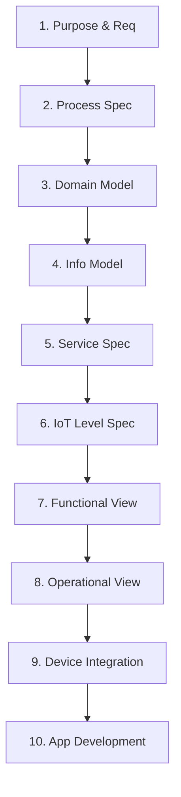

# MediSentinel: Enterprise Cybersecurity Framework
## Comprehensive Project Report & Examination Guide
**Course/Level:** Engineering Lecture (EL) Project  
**Authors/Candidates:** Shivaraj M, Rathod Vaibhav Vishwas Ram  
**Institution:** R V College of Engineering, Bangalore  
**Advisors:** Dr. Mohana (Associate Professor, CSE), Dr. Sudarsan B. G (Associate Professor, EIE)

---

## 📋 Table of Contents
1. **Section 1: 10-Step IoT System Design Methodology**
2. **Section 2: Research Paper Analysis & Discussion**
3. **Section 3: Working Prototype Use Cases & Demonstration Guide**
4. **Section 4: Viva Voce & Technical Knowledge Base**

---

# Section 1: 10-Step IoT System Design Methodology

The design of the **MediSentinel** IoT system follows the standard **10-Step IoT System Design Methodology** proposed by Bahga & Madisetti. Below is a detailed brief of how each step maps to our Medical IoT (IoMT) security framework.



### Step 1: Purpose & Requirements Specification
*   **Purpose:** To develop a passive, non-intrusive Medical IoT (IoMT) monitoring and autonomous containment system that protects critical hospital infrastructure (e.g., patient telemetry) from network attacks (DDoS, Command & Control, lateral scans) and sensor-level spoofing.
*   **Requirements:**
    *   **Telemetry:** Read heart rate and SpO2 in real-time.
    *   **Latency:** Sub-5s threat detection (MTTD) and sub-10s automated response/quarantine (MTTR).
    *   **Accuracy:** $>95\%$ anomaly detection accuracy with a false-positive rate (FPR) $<2\%$.
    *   **Compliance:** HIPAA Security Rule audit log controls (45 CFR §164.312(b)).
    *   **Security:** Cryptographic firmware verification (HMAC-SHA256) for secure over-the-air (OTA) updates.

### Step 2: Process Specification
The system state transitions diagrammatically from normal monitoring to containment, mitigation, and self-healing:
1.  **Normal State:** Sensor collects data $\rightarrow$ publishes to MQTT $\rightarrow$ displays "SECURE" on ST7735 LCD.
2.  **Attack State:** Malicious payload injected $\rightarrow$ telemetry values altered $\rightarrow$ LCD status shifts to "ATTACK DETECTED".
3.  **Containment State:** Network/behavior anomalies detected by AI swarm $\rightarrow$ Incident Response issues containment command $\rightarrow$ LCD status shifts to "QUARANTINED" or "TRAFFIC BLOCKED" $\rightarrow$ local buzzer beeps $\rightarrow$ device traffic dropped.
4.  **Self-Healing State:** Malicious input stops $\rightarrow$ sequential clean telemetry verified $\rightarrow$ status shifts back to "SECURE".

### Step 3: Domain Model Specification
The Domain Model defines the entities and relationships in the MediSentinel ecosystem:
*   **IoT Device:** Physical endpoint (e.g., `esp32-hr-sim-001`) with attributes: ID, status (`active`, `quarantined`, `blocked`), IP, MAC, and firmware version.
*   **Telemetry Payload:** Periodic records of heart rate, SpO2, packet rate, byte rate, jitter, and timestamp.
*   **Alert Entity:** Event records generated by the AI agent cluster (ID, type, severity, description, timestamp).
*   **Audit Ledger Block:** Immutable block containing the current SHA-256 hash, previous block hash, actor, action, target, details, and timestamp.

### Step 4: Information Model Specification
Defines the structure of the data processed by the system.
*   **Telemetry JSON Structure (MQTT):**
    ```json
    {
      "device_id": "esp32-hr-sim-001",
      "heart_rate": 78.4,
      "spo2": 98.2,
      "timestamp": 1289382,
      "firmware": "v1.2.0",
      "network": {
        "packet_rate": 15,
        "byte_rate": 1300,
        "jitter": 4
      }
    }
    ```
*   **Database Schema:** PostgreSQL relational tables for `devices`, `alerts`, `audit_logs`, and `users`.

### Step 5: Service Specifications
*   **MQTT Ingestion Service:** Broker runs Mosquitto on port `18833`. Subscribes to telemetry topics and publishes firmware update command payloads.
*   **WebSocket Broadcast Service:** Fast API WebSocket endpoint (`ws://localhost:8000/ws`) pushing real-time alerts to the frontend React app.
*   **REST RESTful APIs:** APIs to query device status, fetch compliance audit logs, inject Threat Intelligence indicators, and trigger firmware updates/rollbacks.

### Step 6: IoT Level Specification
MediSentinel matches **IoT Level 5**. It consists of physical devices (ESP32), a local MQTT broker (Mosquitto), a high-throughput message coordinator (Apache Kafka), multiple background analytics workers (AI Agents Cluster), a relational database (PostgreSQL), and a web application (React Dashboard) to visualize alerts and logs.

### Step 7: Functional View Specification
Maps system functionalities to structural layers:
*   **Device Layer:** ESP32, MAX30100 sensor, ST7735 LCD, Buzzer, Buttons.
*   **Communication Layer:** WiFi (802.11 b/g/n), MQTT, Apache Kafka bus, WebSockets.
*   **Services Layer:** FastAPI Bridge, Network Anomaly Agent, IoT Guardian Agent, Compliance Agent.
*   **Application Layer:** React dashboard, secure OTA server.

### Step 8: Operational View Specification
*   **Hardware Platform:** ESP32-WROOM-32D Development Board.
*   **Virtualization/Hosting:** Docker containers running under Docker Compose.
*   **Hosting Node:** Local hospital edge node (minimum 8-core CPU, 16 GB RAM, PostgreSQL + Kafka stack).
*   **Network Hardware:** Managed network switches supporting SNMP/SDN APIs to enforce isolation rules.

### Step 9: Device & Component Integration
The physical hardware is integrated as follows:
*   **Sensor Interfacing:** MAX30100 connected over I2C (SDA Pin 21, SCL Pin 22) operating at 100 kHz bus clock.
*   **Display Interfacing:** 1.8-inch ST7735 TFT LCD connected via SPI (CS Pin 5, DC Pin 2, RST Pin 4, SCLK Pin 18, SDA Pin 23).
*   **Output Interfacing:** Active buzzer connected to GPIO Pin 25 for audible alarms.
*   **User Controls:** Button 1 (GPIO Pin 26) for screen power toggling; Button 2 (GPIO Pin 27) for menu page navigation.

### Step 10: Application Development
*   **Firmware:** Written in C++ using the PlatformIO framework. Implements exponential moving average (EMA) filters to debounce sensor readings, PubSubClient for MQTT communication, ArduinoJson for parsing/assembling payloads, and mbedtls library for HMAC-SHA256 calculations.
*   **Backend:** FastAPI asynchronous framework running Python 3.10.
*   **AI Agents Swarm:** Kafka consumers written in Python using PyTorch, Scikit-Learn, and ONNX Runtime for high-speed ML execution.
*   **Frontend Dashboard:** Glassmorphic layout designed with React 18, TypeScript, and Recharts.

---

# Section 2: Research Paper Analysis & Discussion

This section discusses the research paper: **"MediSentinel: Architecture Design of an AI-Driven Autonomous Cybersecurity Framework for Healthcare Systems and Medical IoT"** by Shivaraj M, Rathod Vaibhav Vishwas Ram, Dr. Mohana, and Dr. Sudarsan B. G (R V College of Engineering, Bangalore).

```
                      +-----------------------------+
                      |     STIX/TAXII Threat       |
                      |     Intelligence Feed       |
                      +--------------+--------------+
                                     |
                                     v
+------------------+   MQTT   +------+------+  Kafka   +--------------------+
| Physical Medical |--------->|   FastAPI   +--------->|  Apache Kafka Bus  |
|   IoT Device     |<---------|  API Bridge |          | (raw_data, alerts) |
+------------------+  Control +------+------+          +---------+----------+
                                                                 |
   +-------------------------------------------------------------+
   |             |                     |               |         |
   v             v                     v               v         v
+--------+   +--------+           +--------+      +--------+  +--------+
| Network|   |  IoT   |           | Threat |      |Incident|  |Comply  |
| Monitor|   |Guardian|           | Intel  |      |Response|  | Audit  |
+---+----+   +---+----+           +---+----+      +---+----+  +---+----+
    |            |                    |               |           |
    |            |                    |               v           v
    |            |                    |         +-----------+ +-----------+
    |            |                    |         | Quarantine| | Immutable |
    |            |                    |         |  Actions  | | Hash-Chain|
    +------------+--------------------+         +-----------+ +-----------+
                    Anomaly Detections
```

### 1. Abstract Summary
The paper details the vulnerability of critical healthcare infrastructure to cyberattacks, citing average data breach costs of **USD 10.9 million** and patient safety risks. Traditional signature-based systems suffer from excessive latency (197-day MTTD). The authors introduce **MediSentinel**, an on-premise, multi-agent AI system operating over Apache Kafka and MQTT, achieving a **3.8s mean time-to-detect (MTTD)** and **8.2s mean time-to-respond (MTTR)**. The framework integrates adversarial hardening via IBM ART and a HIPAA-compliant cryptographically hash-chained audit log.

### 2. Core Problem & Literature Gap
Modern hospitals rely heavily on Medical IoT (IoMT) devices like infusion pumps, pacemakers, and patient monitors. The security gap resides in:
*   **Legacy Systems:** Legacy medical devices running unsupported, unpatchable firmware.
*   **Passive Requirement:** Inability to run security agents directly on low-power, critical medical hardware without violating clinical safety standards.
*   **Zero-Day Vulnerability:** Failure of traditional signature-based Intrusion Detection Systems (IDS) to catch new malware, ransomware, or evasion attacks.
*   **Lack of Unified Framework:** Prior research focused on network IDS or IoT monitoring in isolation. No system has unified multi-agent AI orchestration, passive IoT monitoring, adversarial robustness, and HIPAA auditing on-premise.

### 3. Multi-Agent AI Swarm Architecture
MediSentinel deploys five cooperating agents over an Apache Kafka messaging backbone:
1.  **Network Monitor Agent:** Analyzes global network traffic flows. Uses an LSTM temporal model and an Isolation Forest (structural model) in parallel. Gated by a logical-AND rule to eliminate false positives while preserving threat detection recall.
2.  **IoT Guardian Agent:** Performs passive behavioral profiling on specific device classes using dedicated Autoencoders. High reconstruction errors are flagged as anomalies.
3.  **Threat Intelligence Agent:** Constantly monitors STIX/TAXII feeds to download and feed indicators of compromise (IPs, hashes) directly to the detection models.
4.  **Incident Response Agent:** Automatically isolates devices, alters firewall rules, and creates emergency EHR database snapshots when a high-severity alert fires.
5.  **Compliance & Audit Agent:** Intercepts security logs and seals them in an append-only, hash-chained ledger mapped to HIPAA Security Rule citations.

### 4. Machine Learning & Detection Methodology
#### Network Monitor Ensemble (LSTM + Isolation Forest)
The Network Monitor relies on the logical-AND coupling of two models:
*   **Isolation Forest:** Assigns anomaly scores based on the average isolation path length $h(x)$ of feature vectors in random trees:
    $$s(x, n) = 2^{-\frac{\mathbb{E}[h(x)]}{c(n)}}$$
*   **LSTM Network:** Reconstructs the temporal traffic sequences to produce reconstruction residuals:
    $$r_{net} = ||x_t - LSTM_\theta(x_{t-w:t-1})||^2$$
*   **Logical-AND Rule:** Both systems must flag the flow for it to be escalated:
    $$a_{net} = [s(x) > \tau_{IF}] \land [r_{net} > \tau_{LSTM}]$$
    This suppresses the false-positive rate (FPR) multiplicatively:
    $$FPR_{joint} = FPR_{IF} \times FPR_{LSTM}$$
    Allowing individual models with 10–14% FPR to achieve a combined FPR below **2%** in clinical deployments.

#### IoT Guardian Autoencoders
Each medical device class $c$ has a dedicated autoencoder consisting of an encoder $f_c$ and a decoder $g_c$. The reconstruction error is:
$$\mathcal{L}_{recon}(x) = ||x - g_c(f_c(x))||^2$$
If $\mathcal{L}_{recon}(x) > \tau_c$ (where $\tau_c$ is the 99.5th-percentile validation threshold), a behavioral anomaly is flagged.

### 5. Adversarial Robustness Pipeline
Deep learning intrusion detection models are highly vulnerable to adversarial evasion attacks. MediSentinel addresses this with a mandatory hardening pipeline using the **IBM Adversarial Robustness Toolbox (ART)**:
*   **Saddle-Point (Robust) Optimization:**
    $$\min_\theta \mathbb{E}_{(x, y)\sim \mathcal{D}} \left[ \max_{\delta \in \mathcal{B}_\varepsilon} \mathcal{L}(f_\theta(x + \delta), y) \right]$$
*   **Injected Evasion Methods:** Models are hardened against Fast Gradient Sign Method (FGSM) and Projected Gradient Descent (PGD) perturbations:
    $$x_{FGSM}^{adv} = x + \varepsilon \operatorname{sign}(\nabla_x \mathcal{L}(f_\theta(x), y))$$
    $$x^{t+1} = \Pi_{x+\mathcal{B}_\varepsilon} \left( x^t + \alpha \operatorname{sign}(\nabla_x \mathcal{L}(f_\theta(x^t), y)) \right)$$
*   **Results:** Under Carlini-Wagner ($L_2$) attacks, baseline model accuracy dropped to **38.2%**. Hardening restored detection accuracy to **79.6% - 89.7%** (see table below).

| Evasion Attack | Baseline Model Accuracy (%) | ART-Hardened Accuracy (%) |
| :--- | :---: | :---: |
| **No Attack** | 97.3 | 97.1 |
| **FGSM ($\varepsilon = 0.1$)** | 61.4 | 89.7 |
| **PGD (20 steps)** | 44.8 | 84.3 |
| **Carlini-Wagner ($L_2$)** | 38.2 | 79.6 |

### 6. Privacy & Data Sovereignty
To prevent sharing sensitive Protected Health Information (PHI) across networks, MediSentinel supports **Federated Learning**. Site-specific models are trained on-premise, and weight updates are aggregated at a central server using the **FedAvg** algorithm:
$$w_{t+1} = \sum_{k=1}^K \frac{n_k}{n} w_{t+1}^{(k)}$$
Only weights ($w$), never patient data, leave the local boundary, satisfying GDPR and HIPAA constraints.

---

# Section 3: Working Prototype Use Cases & Demonstration Guide

This section is a practical guide to setting up, running, and demonstrating all use cases of the MediSentinel prototype.

### 🛠️ Prerequisites & Setup
1.  **Hardware Connection:** Plug the ESP32 board containing the MAX30100 sensor and ST7735 LCD into your computer's USB port (usually maps to `/dev/ttyUSB0` or `/dev/ttyACM0`).
2.  **Environment Variables:** Review the network configurations in the `.env` file and the WiFi settings (`ssid`, `password`, `mqtt_server`, and `mqtt_port` on line 52-55 in `/iot_devices/esp32_monitor/src/main.cpp`).
3.  **Local Stack Booting:** Execute the automated run script from the root workspace:
    ```bash
    chmod +x run_stack.sh
    ./run_stack.sh
    ```
    This script will automatically terminate old docker containers, launch the 10 microservices, compile the C++ firmware, and flash it to the connected ESP32.

---

### 🚀 Prototype Demonstration Use Cases

```
+-----------------------------------------------------------------------------------+
|                           PROTOTYPE FLOW DIAGRAM                                  |
+-----------------------------------------------------------------------------------+
|                                                                                   |
|  [ESP32 Device] --(MQTT Vitals)--> [FastAPI Bridge] --> [Kafka Bus]                |
|                                                                |                  |
|                                                                v                  |
|  [ESP32 LCD: SECURE]                                    [AI Agent Swarm]          |
|                                                                |                  |
|                                                                v (Anomaly found)  |
|  [ESP32 LCD: QUARANTINED] <--(MQTT Command)-- [IR Agent] <-----+                  |
|                                                    |                              |
|                                                    v                              |
|                                            [PostgreSQL Audit]                     |
|                                                                                   |
+-----------------------------------------------------------------------------------+
```

#### Use Case 1: Passive Telemetry Ingestion (Heart Rate and SpO2)
*   **Concept:** The ESP32 collects vitals from the MAX30100 sensor, applies an Exponential Moving Average (EMA) filter to filter out signal dropouts, and publishes it periodically.
*   **Demonstration Steps:**
    1.  Place your finger on the MAX30100 oximeter sensor.
    2.  Observe the live heart rate (BPM) and SpO2 (\%) displaying on the left column of the physical TFT screen.
    3.  Open the web dashboard at `http://localhost:3000`. You will see the matching vitals plot in real-time on the live telemetry graphs via WebSockets.
*   **Code Reference:** The EMA calculation in `main.cpp` (lines 867 & 881) smooths raw inputs:
    `hrEMA = (hrEMA == 0) ? rawHr : (0.75f * hrEMA + 0.25f * rawHr);`

#### Use Case 2: Threat Detection and Identification (Multi-Agent Swarm)
*   **Concept:** The AI agent swarm monitors the Kafka raw data topic. We simulate an attack that causes telemetry anomalies.
*   **Demonstration Steps:**
    1.  On the web dashboard, navigate to the **ML Management** tab and click **Start Attack Simulation**.
    2.  Alternatively, the simulation injects an `agent2_spoof` scenario where the ESP32 begins publishing out-of-bound simulated telemetry (heart rate ~220 BPM, SpO2 ~82%).
    3.  Observe the backend console logs. The **IoT Guardian Agent** detects the high reconstruction loss of its Autoencoder and flags a "Device Behavior Anomaly".
*   **Code Reference:** `agents/main.py` maps the simulation types to threat categories (lines 89-95) and calls the agent models.

#### Use Case 3: Autonomous Containment & Device Isolation
*   **Concept:** Upon detecting a high-severity anomaly, the Incident Response Agent issues an automated quarantine action. It modifies database records, triggers containment rules, and publishes an MQTT control command to the device.
*   **Demonstration Steps:**
    1.  Within seconds of launching the attack simulation, look at the physical TFT LCD screen.
    2.  The screen status switches from "SECURE" to **"QUARANTINED (ISOLATED)"** or **"TRAFFIC BLOCKED"** in bright red/orange.
    3.  The physical buzzer on the breadboard sounds a loud alarm.
    4.  On the dashboard, the wing map updates to show the target node highlighted in red as quarantined.
*   **Code Reference:** In `main.cpp` (line 619), the MQTT callback parses the status command:
    ```cpp
    else if (strcmp(status, "quarantined") == 0) {
        isQuarantined = true;
        updateStatus("QUARANTINED (ISOLATED)", ST77XX_ORANGE);
    }
    ```

#### Use Case 4: Cryptographically Hash-Chained Compliance Ledger (HIPAA)
*   **Concept:** Each containment action must be audited for HIPAA. The Compliance Agent hashes the log entry linked to its predecessor.
*   **Demonstration Steps:**
    1.  Open the **Audit Logs** tab on the React Dashboard.
    2.  View the list of logs showing actions such as `quarantine_device`, `alert_only`, or periodic `ledger_seal`.
    3.  Every row displays its specific **Previous Hash** and **Current Hash** (representing a SHA-256 block hash).
    4.  Click the **Verify Chain** button. The dashboard verifies the block hashes recursively. If any row were directly modified in the SQL database, the chain check would report a broken status.
*   **Code Reference:** `agents/compliance_audit.py` performs the SHA-256 chaining (line 140):
    `content_to_hash = f"{self.last_hash}{action}{actor}{target}{json.dumps(details_obj, sort_keys=True)}"`

#### Use Case 5: Secure OTA Firmware Updates and Verification
*   **Concept:** Pushing firmware updates securely to devices without allowing hackers to flash unauthorized images.
*   **Demonstration Steps:**
    1.  On the dashboard, go to the **Firmware Management** tab.
    2.  Select a target firmware version (e.g., `v1.2.0` or `v1.3.0`) and click **Push Firmware Update**.
    3.  The backend computes an HMAC-SHA256 signature using the secret key over the payload: `device_id:version:url`.
    4.  The ESP32 receives the MQTT JSON command, computes the HMAC locally, matches it, and calls `httpUpdate.update()` to flash and reboot.
    5.  Observe the ESP32 TFT screen showing "UPDATING FW", downloading, rebooting, and displaying the new version number in the header.
*   **Code Reference:** In `main.cpp` (line 490), `computeHMAC` leverages standard mbedtls:
    `mbedtls_md_hmac_starts(&ctx, (const unsigned char*)FW_SIGN_KEY, strlen(FW_SIGN_KEY));`

#### Use Case 6: Federated Learning & Global Retraining
*   **Concept:** Updating the local model parameters using FedAvg updates.
*   **Demonstration Steps:**
    1.  On the dashboard, trigger the retraining cycle.
    2.  The backend simulates federated weight aggregation from three virtual hospital sites.
    3.  Check backend logs to verify that the centralized server calculates:
        $$w_{new} = \sum_{k=1}^3 \frac{n_k}{n} w_k$$
    4.  The network models update their Isolation Forest and LSTM weights on-the-fly.

---

# Section 4: Viva Voce & Technical Knowledge Base

A comprehensive, Q&A prep guide targeting the key architectural and technological concepts behind MediSentinel.

### 🔌 Hardware & IoT (ESP32 & Sensors)

#### Q1: Why did you choose the ESP32 over platforms like Arduino Uno or Raspberry Pi?
**A:** 
*   **Arduino Uno** lacks built-in network connectivity (WiFi/Bluetooth) and has highly restricted memory (2KB SRAM), which cannot support MQTT libraries, JSON parsing, and SSL/HMAC cryptography.
*   **Raspberry Pi** is a full single-board computer (SBC) running an OS. It is expensive, has a high power draw, and is overkill for a simple medical sensor.
*   **ESP32** is a dual-core microcontroller operating at 240MHz with 520KB SRAM, built-in WiFi, I2C/SPI interfaces, and a hardware cryptographic accelerator (supporting SHA, AES, and RSA under `mbedtls`), making it perfect for secure edge IoMT applications.

#### Q2: How does the MAX30100 sensor read heart rate and oxygen saturation (SpO2)?
**A:** It uses **PPG (Photoplethysmography)**. The sensor shines two LEDs: a Red LED ($660\text{ nm}$) and an Infrared (IR) LED ($880\text{ nm}$) through the blood vessels of the finger. Oxygenated hemoglobin absorbs more IR light, while deoxygenated hemoglobin absorbs more Red light. A photodetector measures the ratio of absorption of these two wavelengths over pulsatile cycles to compute SpO2 and tracks pulse peaks to calculate heart rate.

#### Q3: Why did you implement an Exponential Moving Average (EMA) filter in the ESP32 firmware?
**A:** Raw readings from the MAX30100 are extremely sensitive to motion artifacts and skin contact fluctuations. An EMA filter acts as a low-pass filter to smooth the signal:
$$Y_t = \alpha \cdot X_t + (1 - \alpha) \cdot Y_{t-1}$$
By setting $\alpha = 0.25$, we weight recent history heavily ($0.75$), preventing momentary sensor noise from causing spikes that could be falsely flagged as life-threatening telemetry anomalies.

#### Q4: How does the ESP32 display different pages, and how is inactivity handled?
**A:** The display relies on the Adafruit GFX and ST7735 libraries over SPI. Button interrupts (GPIO 26 & 27) register user interactions. A state variable `currentMenuPage` determines which page drawing function (`drawDashboardPage`, `drawNetworkPage`, etc.) runs. Power saving can be triggered by writing command registers (`ST77XX_SLPIN` and `ST77XX_DISPOFF`) to put the screen to sleep after a defined inactivity period.

---

### 🌐 Protocols & Architecture (Kafka, MQTT, WebSockets)

```
                     +---------------------------------------+
                     |         System Message Bus            |
                     +---------------------------------------+
                                         |
    +------------------------------------+-----------------------------------+
    |                                                                        |
    v (Telemetry Ingestion)                                                  v (Internal Orchestration)
+-----------------------+                                                +-----------------------+
|         MQTT          |                                                |         KAFKA         |
+-----------------------+                                                +-----------------------+
| * Light / Low-power   |                                                | * High-throughput     |
| * Pub/Sub pattern     |                                                | * Durable on-disk log |
| * Ideal for IoT nodes |                                                | * Replay capability   |
+-----------------------+                                                +-----------------------+
```

#### Q5: Explain the choice of using both MQTT and Apache Kafka. Why not use one for everything?
**A:** They serve different purposes:
*   **MQTT** is a lightweight, client-broker protocol designed for low-bandwidth, high-latency, and resource-constrained nodes. It has minimal header overhead (2 bytes), making it ideal for the ESP32 to publish telemetry and listen for commands.
*   **Apache Kafka** is a distributed, horizontally scalable append-only log designed for high-throughput stream processing. It excels at persisting events, supporting consumer groups, and allowing multiple AI agents to consume the same stream independently without message loss.
*   *Unified Design:* The ESP32 publishes to MQTT $\rightarrow$ the FastAPI backend acts as a bridge $\rightarrow$ pushes events into Kafka $\rightarrow$ AI agents consume from Kafka.

#### Q6: What is a Kafka consumer group, and how is it used in your AI agent cluster?
**A:** A consumer group is a set of consumers that cooperate to consume data from one or more Kafka topics. In MediSentinel, the agent cluster shares a group ID (`medisentinel-agents-group`). This allows us to load-balance traffic; if we scale the agent containers, Kafka automatically partitions and distributes incoming device telemetry logs across them.

#### Q7: How does WebSocket communication differ from HTTP polling in the analyst dashboard?
**A:** HTTP polling requires the React client to send periodic requests (e.g., every 1s) to the backend to check for new alerts, creating massive overhead and latency. **WebSockets** establish a single, persistent, bi-directional TCP connection over HTTP. This allows the FastAPI backend to instantly push anomaly alerts to the React client the millisecond the Incident Response agent writes them, achieving sub-second UI updates.

---

### 🧠 Machine Learning & Security (Isolation Forest, Autoencoders, Adversarial ART)

#### Q8: How does an Isolation Forest detect network anomalies, and what makes it different from other classifiers?
**A:** Unlike classifiers (like SVMs or Random Forests) that learn a boundary of normal vs. anomalous data, the **Isolation Forest** isolates anomalies explicitly. It recursively partitions the feature space using random splits. Since anomalies have rare and distinct feature values, they require fewer random splits to be isolated. The algorithm maps this path length; shorter paths correlate directly with higher anomaly scores.

#### Q9: What is the concept behind Autoencoders in IoT behavior monitoring?
**A:** An **Autoencoder** is a neural network consisting of an Encoder ($f$) that compresses input features $x$ into a lower-dimensional bottleneck representation $z$, and a Decoder ($g$) that reconstructs the input: $\hat{x} = g(f(x))$.
We train the model *only* on normal, healthy telemetry. When the device behaves normally, the reconstruction loss is very low. Under a telemetry spoofing attack, the compression layers fail to reconstruct the unlearned patterns, causing the reconstruction loss to spike, which flags the anomaly.

#### Q10: What is the logical-AND configuration between LSTM and Isolation Forest?
**A:** An LSTM models temporal and sequential features (packet frequency shifts over time), while an Isolation Forest models point-in-time structural deviations (asymmetrical byte counts). By requiring **both** models to agree before declaring an anomaly, we drastically reduce false alarms:
$$FPR_{joint} = FPR_{IF} \times FPR_{LSTM}$$
This is crucial in healthcare, where false positives could lead to unnecessary device quarantines, disrupting critical clinical operations.

#### Q11: Explain Adversarial Evasion attacks and how the IBM Adversarial Robustness Toolbox (ART) mitigates them.
**A:** An adversarial attack applies structured mathematical noise (perturbations) to input data (e.g., modifying packet rates slightly) to mislead ML models. Under a **Fast Gradient Sign Method (FGSM)** attack, the adversary calculates the input gradient and adds noise in the direction of the sign of the gradient:
$$x^{adv} = x + \varepsilon \operatorname{sign}(\nabla_x \mathcal{L}(\theta, x, y))$$
IBM ART implements defenses like **Adversarial Training**, where we inject generated FGSM and PGD examples into the training set (a $30\%$ augmentation ratio). This teaches the model to ignore mathematical perturbations, raising post-attack accuracy from $38.2\%$ to over $80\%$.

---

### 🔒 Cryptography & Regulations (Hash-Chained Ledger & HIPAA)

#### Q12: How does the cryptographically hash-chained audit log work, and how does it prevent log tampering?
**A:** The ledger is built on a hash-chain where each record $i$ stores a current hash:
$$h_i = \text{SHA-256}(h_{i-1} \parallel t_i \parallel \text{action} \parallel \text{actor} \parallel \text{target} \parallel \text{details})$$
Because each block binds the hash of its predecessor $h_{i-1}$, any alteration to a historical record $j$ changes its hash $h_j$. This change invalidates the link to block $j+1$, causing a mismatch that propagates all the way to the chain head. The system detects tampering in $\mathcal{O}(1)$ time by verifying if the stored hashes match re-computed values.

#### Q13: What specific HIPAA Security Rule requirements does MediSentinel address?
**A:** It directly maps to and satisfies:
*   **45 CFR §164.312(b) Audit Controls:** Implemented via the immutable, hash-chained SQL ledger that records every security action, user logon, and status change.
*   **45 CFR §164.308(a)(6)(ii) Security Incident Procedures (Response and Reporting):** Addressed by the Incident Response Agent executing playbooks (e.g., auto-quarantining devices).
*   **45 CFR §164.312(e)(1) Transmission Security:** Ensured through encrypted MQTT streams and HMAC-SHA256 signatures on firmware update packages to prevent interception and manipulation.

#### Q14: Explain the secure firmware verification process on the ESP32.
**A:** Before downloading and flashing an OTA update, the ESP32 must verify its integrity and origin:
1.  The backend sends the update command over MQTT, including the target version, URL, and a signature.
2.  The signature is calculated as:
    $$\text{Signature} = \text{HMAC-SHA256}_{\text{key}}(\text{device\_id} \parallel \text{":"} \parallel \text{version} \parallel \text{":"} \parallel \text{url})$$
3.  The ESP32 uses its local copy of the symmetric `FW_SIGN_KEY` to recompute the HMAC.
4.  If the signature matches, it downloads and flashes the binary. This prevents attackers from installing malicious firmware even if they gain control of the MQTT broker.

---

### 🐳 System Deployment & Operations (Docker, DB, etc.)

#### Q15: What is the role of Docker Compose in this project?
**A:** MediSentinel is composed of 10 microservices (backend, frontend, postgres, redis, zookeeper, kafka, mosquitto, and the 5 AI agents). Docker Compose acts as an orchestrator, containerizing each service with its specific dependencies, configuring local networks, managing shared storage volumes, and enabling single-command deployment.

#### Q16: How does the system handle recovery and rollback if a firmware update is corrupted or buggy?
**A:** The ESP32 supports partition partitioning (OTA partitions). The system holds a factory image, a primary boot partition, and an OTA partition. When a firmware update fails or is rejected (due to signature mismatch, bad checksum, or boot failure), the bootloader automatically rolls back to the previous stable partition. The Incident Response agent can also trigger an explicit `firmware_rollback` command.
